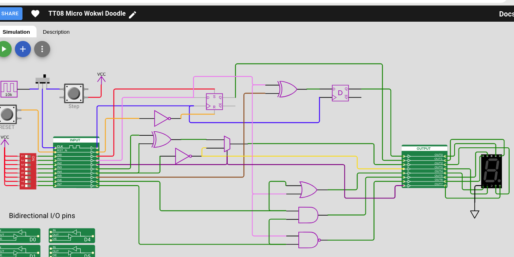

   

# How I did it

* Build the project first using normal Wokwi TT08 template method
* Download GDS workflow file tt_submission.zip
* Extract contents and copy files into this project (careful to exclude from copying config*.json user_config.json)

```
# Extract the files from downloaded ZIP
unzip tt_submission.zip -d tt_submission

# Extract wokwi generated verilog files
cp -avi tt_submission/src/*.v src/

# Extract wokwi_diagram.json
cp -avi tt_submission/src/wokwi_diagram.json src/

# Remove all references to signals: ena uio_in uio_out uio_oe
egrep -v " (uio_(oe|out|in)|ena)" src/tt_um_wokwi_408272151035187201.v > src/tt_um_wokwi_408272151035187201.v.tmp

# Check the results look ok
diff -u src/tt_um_wokwi_408272151035187201.v src/tt_um_wokwi_408272151035187201.v.tmp

# Overwrite original with changes
mv src/tt_um_wokwi_408272151035187201.v.tmp src/tt_um_wokwi_408272151035187201.v

# Edit info.yaml to fixup source_files: tt_um_wokwi_408272151035187201.v cells.v

# Edit info.yaml to fixup top_module_name: tt_um_wokwi_408272151035187201

# Edit info.yaml to copy pinout section from full 1x1 tile wokwi project

# Alternatively I added verilog preprocessor `ifndef TINYTAPEOUT_MICRO_FORMAT
# to see if the standard wokwi verilog generator can just emit this by default
# and the micro format can set the verilog preprocessor by default.

# Edited src/tt_um_wokwi_408272151035187201.v with verilog ifndef around
# top level module ports and default assignment to GND.

# Added to src/config.json the: "VERILOG_DEFINES": ["TINYTAPEOUT_MICRO_FORMAT"],
# Added to src/config.json the: "LINTER_DEFINES": ["TINYTAPEOUT_MICRO_FORMAT"],

# Let the project build.
```


Original full TT 1x1 tile project.  Need to manually extract verilog to
include in project https://github.com/dlmiles/tt08-wokwi-doodle/

[Wokwi Project: 408272151035187201](https://wokwi.com/projects/408272151035187201)




# Tiny Tapeout Factory Test

- [Read the documentation for project](docs/info.md)

## What is Tiny Tapeout?

Tiny Tapeout is an educational project that aims to make it easier and cheaper than ever to get your digital and analog designs manufactured on a real chip.

To learn more and get started, visit https://tinytapeout.com.

## Set up your Verilog project

1. Add your Verilog files to the `src` folder.
2. Edit the [info.yaml](info.yaml) and update information about your project, paying special attention to the `source_files` and `top_module` properties. If you are upgrading an existing Tiny Tapeout project, check out our [online info.yaml migration tool](https://tinytapeout.github.io/tt-yaml-upgrade-tool/).
3. Edit [docs/info.md](docs/info.md) and add a description of your project.
4. Adapt the testbench to your design. See [test/README.md](test/README.md) for more information.

The GitHub action will automatically build the ASIC files using [OpenLane](https://www.zerotoasiccourse.com/terminology/openlane/).

## Enable GitHub actions to build the results page

- [Enabling GitHub Pages](https://tinytapeout.com/faq/#my-github-action-is-failing-on-the-pages-part)

## Resources

- [FAQ](https://tinytapeout.com/faq/)
- [Digital design lessons](https://tinytapeout.com/digital_design/)
- [Learn how semiconductors work](https://tinytapeout.com/siliwiz/)
- [Join the community](https://tinytapeout.com/discord)
- [Build your design locally](https://docs.google.com/document/d/1aUUZ1jthRpg4QURIIyzlOaPWlmQzr-jBn3wZipVUPt4)

## What next?

- [Submit your design to the next shuttle](https://app.tinytapeout.com/).
- Edit [this README](README.md) and explain your design, how it works, and how to test it.
- Share your project on your social network of choice:
  - LinkedIn [#tinytapeout](https://www.linkedin.com/search/results/content/?keywords=%23tinytapeout) [@TinyTapeout](https://www.linkedin.com/company/100708654/)
  - Mastodon [#tinytapeout](https://chaos.social/tags/tinytapeout) [@matthewvenn](https://chaos.social/@matthewvenn)
  - X (formerly Twitter) [#tinytapeout](https://twitter.com/hashtag/tinytapeout) [@tinytapeout](https://twitter.com/tinytapeout)
